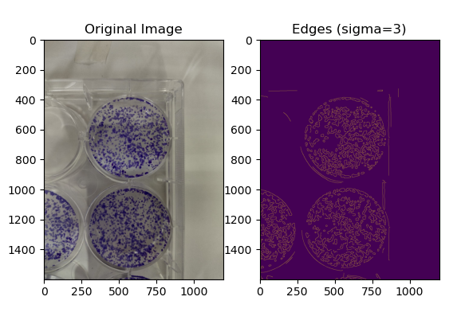
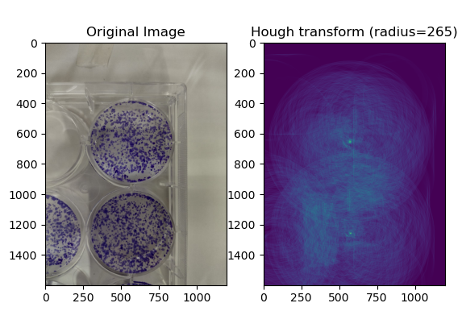

# CloMA
CloMA - Clonal Morphometry Analysis

# Usage guide! (For interactive pipeline)

### 1- Download this repository

### 2- Install the libraries in the CloMA_env.yml

Example using ```conda```
```
conda env create -f CloMA_env.yml
```

### 3- Run the pipeline:

```
python3 CloMA/run_pipeline
```

| Remember to choose the path to where you have installed the repository.

### 4- Input the path to your image or folder containing images.

### 5- Input the output folder to save results.

### 6- Test values for sigma for edge detection



This is a good level of detail in the edges.

### 7- Test radius values for Hough transform.


    
This is a good result! - Check for very small and bright points in the positions of the center of the wells

### 8- Done! wait for CloMA automatically do the rest ;)

    

